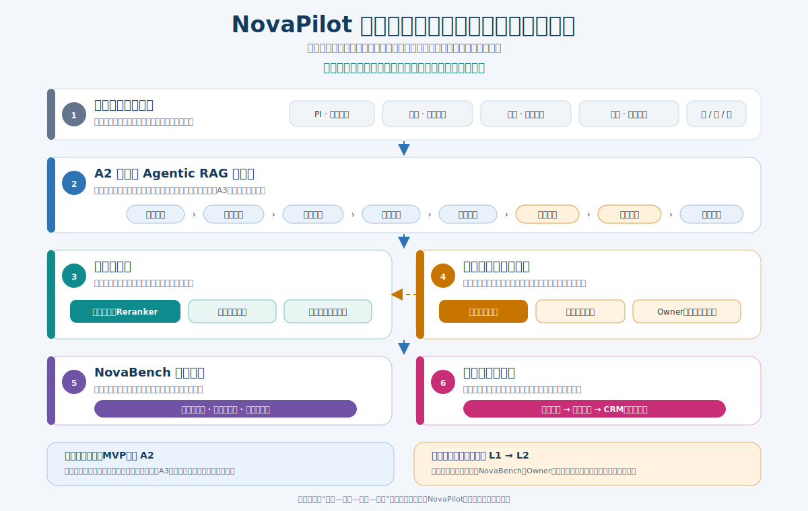
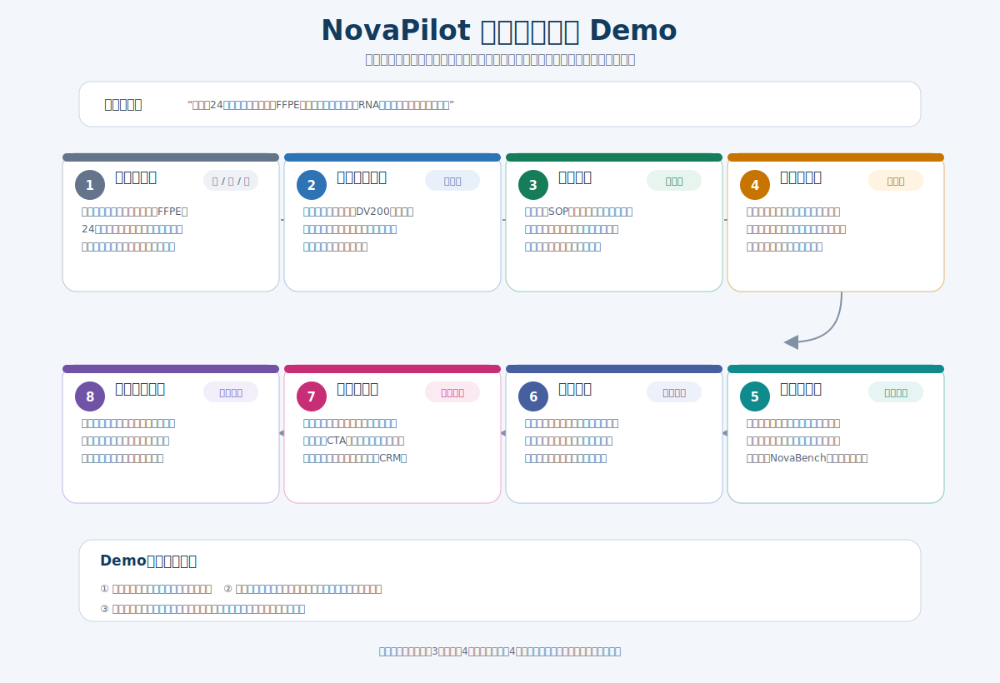
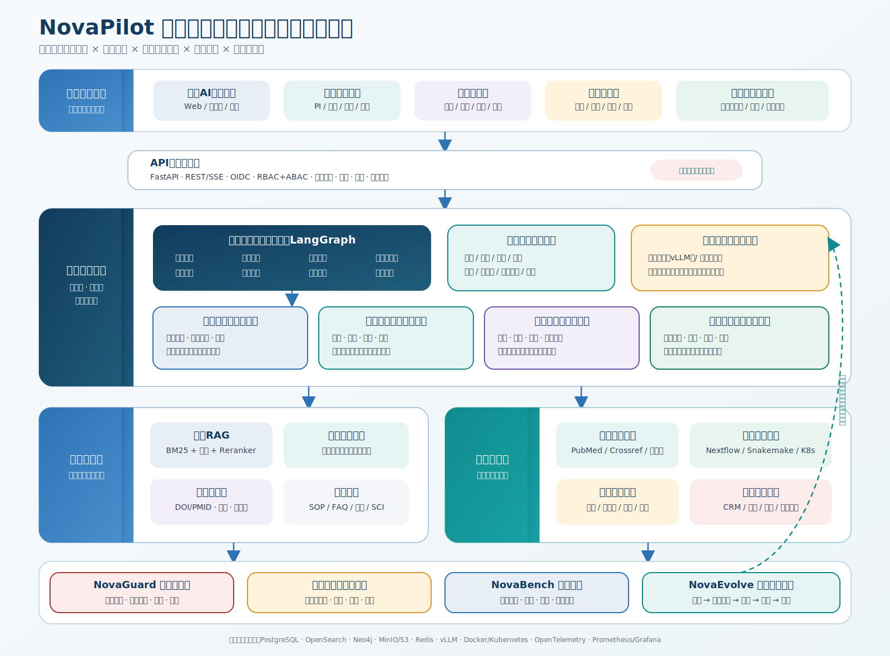

# NovaPilot 3.0 产品需求文档（PRD）

**文档定位：** 完整产品蓝图 + 12 周可信 MVP 执行规格  
**产品定位：** AI 驱动的科研客户技术支持与咨询服务体系  
**版本：** V1.0（评审基线）  
**状态：** 已完成产品边界访谈，可进入评审与排期  
**日期：** 2026 年 7 月 19 日  
**适用读者：** 竞赛评委、业务负责人、产品、研发、算法、科研专家、服务运营、销售运营与合规团队

> **核心主张** 不做会自我进化的黑箱，做“有据才答、该转就转、评测后进化、信任后转化”的科研服务闭环。

---

## 0. 文档使用说明

本 PRD 采用双层结构：一方面描述 NovaPilot 未来 12 个月的完整产品蓝图，完整响应四角色、四场景、三语交流、人机协同、知识进化与营销融合要求；另一方面将 12 周可信 MVP 拆为可开发、可验收、可灰度的 P0 需求。

需求优先级定义如下：

- **P0｜可信 MVP：** 12 周内必须交付，缺失即不能进入定向客户试点。
- **P1｜规模化服务：** 3–6 个月交付，扩展到四大场景、企业角色与完整运营治理。
- **P2｜服务操作系统：** 6–12 个月交付，增加生信执行、可复现产物链和受限自主规划。
- **禁止项：** 不因路线图或演示需要进入生产，包括临床诊断、无人审生产自改等。

### 0.1 评审结论

本版已经确认以下不可妥协的产品边界：

- 以“安全自助解决率”而不是普通自助率为北极星指标。
- 以“科研决策卡”而不是聊天记录为核心交付物。
- 科学结论、服务适配说明和销售动作必须分层。
- 强制转接后，AI 不再输出可直接执行的最终方案。
- 自进化只能自动形成项目记忆和候选知识/策略，不能自动改写生产系统。
- 敏感科研数据留在诺禾私有环境，外部模型仅处理策略允许的脱敏内容。

## 1. 产品摘要

### 1.1 产品愿景

将诺禾致源现有 AI 科研助手升级为科研客户获取专业服务的第一入口：系统能够理解一个跨越数周或数月的科研项目，基于内部 SOP 与 SCI 证据生成可执行建议，在证据不足或风险较高时无损转交专家，并将专家修订沉淀为经过评测和审批的组织能力。

### 1.2 需要解决的问题

现有科研助手具备文献检索、方案生成、生信分析和写作能力，但仍以单次问答为中心，存在五类断点：

1. 项目事实散落在多轮对话中，客户需要重复描述样本、目标和约束。
2. 答案引用与具体结论未逐条绑定，无法证明建议适用于当前样本和 SOP 版本。
3. AI 与解决方案专家之间缺少结构化交接，人工仍需重新问诊。
4. 专家修订没有形成可治理的知识资产，类似问题反复消耗专家工时。
5. 服务推荐与科学建议边界不清，容易损害客户对专业中立性的信任。

### 1.3 产品解法

NovaPilot 以科研项目状态为主线，提供一个入口、一个项目驾驶舱、四类专业智能体和两个贯穿能力：

- **项目驾驶舱：** 管理项目事实、材料、决策卡版本、证据、待办和专家状态。
- **四类专业智能体：** 实验方案设计、测序平台选择、数据分析推荐、结果解读与论文支持。
- **NovaGuard：** 执行证据、风险、权限、数据出域和动作审计。
- **NovaEvolve：** 从失败咨询、专家修改和客户反馈中生成候选知识或候选策略，经评测审批后灰度发布。

### 1.4 MVP 一句话范围

可信 MVP 在 FFPE/RNA 咨询中打通“中英日建档—最小必要追问—循证实验方案—平台选型—风险分级—专家接管—决策卡交付—满意度闭环—授权式 CRM 转化”，运行时锁定 A2，知识进化锁定 L1。

## 2. 产品目标、指标与非目标

### 2.1 产品目标

**G1｜提高安全解决能力。** 在不提高自信错答和重大风险的前提下，让客户通过 AI 获得完整、可执行、可追溯的科研建议。

**G2｜缩短人工处理时间。** 专家接管时直接获得完整项目事实、证据、AI 尝试、风险和待决策项，避免重新问诊和重复检索。

**G3｜形成可信知识飞轮。** 把专家修改和失败案例转化为候选知识，经 Owner、NovaBench、审批和灰度后进入生产。

**G4｜建立信任型增长。** 先完成科学适配，再透明说明诺禾服务价值；仅在客户授权后创建 CRM 商机。

**G5｜实时感知客户需求。** 从咨询主题、缺口、角色、地区与转化行为中提炼产品、内容和推广洞察。

### 2.2 指标体系

| 层级 | 指标 | 口径 | 目标/门禁 |
|---|---|---|---|
| 北极星 | 安全自助解决率 | 无人工介入完成，且通过金标、专家抽审或后续结果验证 | 试点目标 55%–65% |
| 安全门禁 | 高风险转接召回率 | 应转专家案例中被及时识别并转接的比例 | ≥95% |
| 安全门禁 | 引用有效率 | DOI/PMID、内部文档链接、版本与可访问状态均有效 | ≥98% |
| 安全门禁 | 自信错答率 | 应追问或升级却高置信输出错误专业结论 | 不得相对试点基线恶化 |
| 体验 | 首次响应时间 | 客户提交问题到系统首次有效响应 | 缩短 ≥90% |
| 效率 | 专家平均处理时长 | 专家认领到关闭的有效处理时长 | 下降 35%–45% |
| 质量 | 七日重复开单率 | 同一项目因同一未解决问题再次开单 | 下降 ≥25% |
| 满意度 | CSAT | 决策卡或专家服务完成后的 5 分评分 | 提升 8–12 个百分点 |
| 增长 | 有效新客户触达 | 新客户完成有效咨询、建档或授权动作 | 增长 30%–50% |

业务目标在 4–6 周基线测量后按产品线与客户角色校准，不作为首版上线硬门禁；安全门禁是任何放量阶段的必要条件。

### 2.3 可信 MVP 明确不做

- 不自动执行完整生信流程；仅可展示分析建议和后续路线图能力。
- 不控制湿实验设备，不自动提交样本或改变实验参数。
- 不提供临床诊断、治疗建议或面向患者的医疗决策。
- 不自动报价、签约、承诺交付周期或创建未经授权的销售商机。
- 不开放 A3 自主多步科研规划进入生产关键路径。
- 不在线更新模型权重，不允许智能体代码、正式 SOP 或生产工作流自改上线。
- 不在首期交付实时语音/视频、企业批次治理和企业合同 SLA。

## 3. 用户、角色与核心任务

### 3.1 首期用户优先级

可信 MVP 以博士后和研究生作为主要操作用户，以实验室 PI 作为方案决策与审批用户。企业研发人员保留完整产品体验设计，但不作为首期流程优化和指标验收的主要样本。

| 角色 | 主要任务 | 默认体验 | MVP 定位 |
|---|---|---|---|
| 博士后 | 比较方法、调整参数、验证创新性和可复现性 | 专业协作模式、参数与文献对比 | 主要操作用户 |
| 研究生 | 补齐条件、理解术语、按步骤完成方案 | 分步向导、原因解释与检查清单 | 主要操作用户 |
| 实验室 PI | 判断可行性、预算、周期、风险和发表潜力 | 一页决策摘要、主备方案与审批 | 决策用户 |
| 企业研发 | 管理批次、SLA、权限、合规和知识产权 | 企业项目空间与治理看板 | P1 重点用户 |

### 3.2 核心 Jobs-to-be-Done

- 当我只有研究目标和一批样本时，帮助我知道还缺哪些会改变方案的条件。
- 当多个实验或平台方案都“看起来可行”时，帮助我理解差异、风险、成本和证据。
- 当样本质量不理想或需求非标时，帮助我尽快找到合适专家且无需重新描述。
- 当 PI 需要审批时，提供一份可追溯、可比较、可导出的正式决策材料。
- 当我更换语言或阅读外文资料时，保持科研实体、数值、证据和项目状态一致。
- 当我对答案不满意时，能快速纠错、请求人工并看到处理进度。

### 3.3 角色体验原则

- 角色只改变默认信息密度、解释方式和操作顺序，不改变底层项目事实与证据。
- 用户可以在“快速决策、专业协作、学习引导”模式之间切换。
- 系统不能仅凭账号角色假设用户能力；关键实验条件仍需明确确认。
- 销售人员不能修改科学结论、风险等级、证据状态或专家意见。

## 4. 核心产品对象：科研决策卡

### 4.1 定义

科研决策卡是一次咨询的版本化正式交付物。聊天只是收集条件、解释决策和协作的界面；项目记忆、证据、专家修改、PI 审批和后续转化均围绕决策卡组织。

### 4.2 必备字段

| 字段组 | 必备内容 |
|---|---|
| 身份与版本 | 决策卡 ID、项目 ID、版本、创建者、创建时间、当前状态、客户语言 |
| 问题与目标 | 客户问题重述、研究目标、目标终点、成功判据 |
| 项目事实 | 物种、样本类型、数量、分组、质量、预算、周期、来源和确认状态 |
| 缺失条件 | 会改变方案但尚未确认的条件、追问原因和影响 |
| 决策内容 | 主方案、至少一个备选方案、平台与关键参数、选择理由 |
| 证据 | 每条关键建议对应的 SOP/文献、版本、适用范围、有效期和原文链接 |
| 风险 | 风险等级、失败模式、不可逆动作、适用边界和转接原因 |
| 服务信息 | 诺禾服务适配说明、限制、替代方案；与科学结论分区展示 |
| 协作状态 | AI/专家状态、修改差异、PI 审批、下一步和负责人 |

### 4.3 状态机

`草稿 → 待补充条件 → 证据审查 → 风险判定 → 暂行/专家待审/正式 → PI 已批准 → 已交付 → 已关闭`

补充状态：

- 新版本发布后，旧版本进入“已被替代”，但保留完整审计记录。
- 证据过期或 SOP 版本变化时，受影响版本进入“待复核”，不得继续作为默认正式结论。
- 高风险或强制转接状态下，只有专家批准才能生成正式决策卡。

### 4.4 风险分级与审批

| 风险 | 判定特征 | 可发布内容 | 审批要求 |
|---|---|---|---|
| 低风险 | 条件完整、证据一致、动作可逆、错误代价低 | AI 正式决策卡，标识“AI 生成、证据已校验” | 无强制专家审批 |
| 中风险 | 存在不确定条件、证据外推或成本较高，但可通过复核控制 | 暂行决策卡，显式限制并提供一键复核 | 客户可申请；系统可按规则触发 |
| 高风险 | 证据冲突、样本非标/极低质量、人源合规或不可逆高成本动作 | 仅展示已核实事实、风险和待决策项 | 专家强制审批 |

## 5. 端到端用户流程

### 5.1 黄金路径

1. **进入与识别：** 用户从现有 AI 科研助手、官网或海外门户发起问题；系统识别语言、角色和是否存在历史项目。
2. **跨语言建档：** 从文本或附件提取研究目标、样本、数量、分组、质量、预算和周期，生成待确认项目事实。
3. **最小必要追问：** 只询问会改变实验方案或平台选择的条件，并解释“为什么需要”。
4. **并行取证：** 检索现行内部 SOP、产品规则、SCI 文献和历史已批准案例；对科研实体和样本适用性过滤。
5. **方案生成与复核：** 专业智能体生成主备方案；Reviewer 检查结论—证据绑定、引用、数值和适用边界。
6. **风险分流：** 低风险形成正式卡，中风险形成暂行卡，高风险通过一次性交接包转专家。
7. **决策与服务：** 用户比较方案、PI 审批；系统在独立区域展示服务适配说明。
8. **授权转化与反馈：** 客户主动获取报价或预约专家后写入 CRM；完成后收集 CSAT 和 7 日有效性反馈。
9. **受治理沉淀：** 专家修改和失败案例生成候选知识/策略，经过评测、审批、灰度和回滚治理。

### 5.2 FFPE/RNA 示例的最小必要问题

- 样本是否配对，分组和批次如何分布？
- 是否有 DV200 或等效 RNA 质量指标，检测方法和时间是什么？
- FFPE 保存时间、固定条件、提取方法和可用组织量是否一致？
- 研究目标是稳定差异表达、融合/突变探索还是转录本结构分析？
- 可接受的失败风险、预算区间和交付时间是什么？

系统不得在这些条件未补齐前给出无条件的确定参数；可给出条件性路径，但必须明确假设。

## 6. 功能需求总览

### 6.1 P0 模块

| 编号 | 模块 | P0 结果 |
|---|---|---|
| P0-01 | 统一入口与身份 | 复用现有科研助手入口，支持匿名轻体验、登录建档和项目续接 |
| P0-02 | 项目驾驶舱 | 保存项目事实、附件、决策卡版本、待办与专家状态 |
| P0-03 | FFPE/RNA 实验方案 | 最小追问、主备方案、风险和证据 |
| P0-04 | 平台选型 | 基于读长、通量、质量、周期和预算生成适配比较 |
| P0-05 | 三语咨询 | 中英日输入、回答、决策卡和专家交接 |
| P0-06 | 循证 RAG | 内部 SOP + SCI 混合检索、重排、适用性过滤和引用校验 |
| P0-07 | Reviewer | 检查关键结论证据、引用、数值、冲突和风险 |
| P0-08 | 分级审批 | 低/中/高风险对应正式、暂行和专家强制审批 |
| P0-09 | 专家工作台 | 一次性交接、认领、修改、批准、退回和 SLA |
| P0-10 | 受治理沉淀 | 从专家修改生成候选知识，保留来源、Owner 和版本 |
| P0-11 | 授权式增长 | 服务适配卡、客户授权、CRM 写入和状态回传 |
| P0-12 | 体验与运营 | 实时反馈、质量事件、指标看板和灰度门禁 |

### 6.2 P1/P2 扩展

- P1 覆盖数据分析方法推荐、结果解读与论文支持，形成四场景闭环。
- P1 增加企业研发工作台、轻量决策本体、NovaGuard 控制台和 L2 候选策略。
- P2 接入 Nextflow/Snakemake 生信执行、可复现科研产物链和实时语音。
- P2 的 A3 仅限沙箱，只有在 NovaBench 上显著优于 A2 且安全不退化时才考虑受限开放。

## 7. P0 详细需求与验收标准

### 7.1 P0-01 统一入口与项目创建

**用户价值：** 用户可以先完成一次轻量咨询，在需要保存、上传材料、跨设备继续或申请专家时再创建项目。

**功能要求：**

- 支持从现有 AI 科研助手、官网组件和海外门户进入同一咨询服务。
- 匿名用户可进行轻量问题澄清，但保存决策卡、上传敏感文件、预约专家前必须登录。
- 登录后优先匹配历史项目；用户可新建、合并或明确选择项目。
- 创建项目时展示数据使用说明、跨境/外部模型策略和客户授权状态。

**验收标准：**

- 给定登录用户存在历史项目，当其输入同一研究主题时，系统推荐关联项目但不得自动合并。
- 匿名用户上传敏感材料时，系统阻止上传并引导登录与同意数据条款。
- 所有入口产生统一 `trace_id`，可追踪到项目、咨询和后续工单。

### 7.2 P0-02 项目驾驶舱与项目事实

**用户价值：** 用户不用在每次咨询中重复描述样本和约束，并能知道哪些信息来自自己、AI 或专家。

**功能要求：**

- 项目事实至少包含研究目标、物种、样本类型、数量、分组、质量、预算、周期和历史决策。
- 每条事实保存来源、提取时间、置信度、客户确认状态、版本和可见范围。
- AI 提取内容必须由用户确认后才能成为正式项目事实。
- 冲突事实并存显示，不能静默覆盖；用户或专家完成裁决后保留历史。
- 支持附件与事实关联，例如将 DV200 绑定到质控报告页码或表格单元格。

**验收标准：**

- AI 识别的“24 份 FFPE 样本”默认处于待确认，用户确认后才进入正式项目状态。
- 当新附件与已确认样本数量冲突时，系统生成冲突提示并暂停依赖该事实的最终方案。
- 删除项目时按数据保留策略执行，关联 CRM/工单仅解除引用，不擅自删除其主数据。

### 7.3 P0-03 最小必要追问

**用户价值：** 系统只问会改变决策的问题，减少问卷式负担。

**功能要求：**

- 根据目标、样本和当前缺口生成追问计划，标注每个问题影响的决策项。
- 每轮默认最多提出 3 个问题；高关联问题可组合，但不得一次展示长问卷。
- 用户“不知道”时提供检测方法、默认假设或专家路径，不能无限循环。
- 已确认项目事实不得重复询问，除非出现冲突或证据版本变化。

**验收标准：**

- 对 FFPE/RNA 差异表达案例，系统必须识别 DV200/等效质量、配对/批次、提取与组织量等关键缺口。
- 删除任一追问后，若其不会改变最终方案或风险等级，应被标记为非必要并退出默认流程。
- 同一事实在项目内不得无原因重复追问。

### 7.4 P0-04 实验方案设计与平台选型

**用户价值：** 用户获得可比较、可执行且带适用边界的主备方案。

**功能要求：**

- 实验方案至少给出主方案、备选方案、关键参数、样本质控、批次控制、失败风险和验证步骤。
- 平台选择根据读长、通量、准确性、样本数量、研究目标、预算和周期生成适配评分。
- 服务推荐不能改变科学排序；诺禾产品信息在独立“服务适配说明”中展示。
- 预算和周期只展示经产品系统或人工确认的区间，不由模型自行编造。

**验收标准：**

- 主方案和备选方案必须说明选择与不选择理由。
- 缺少关键条件时只能输出条件性方案，不得伪装成确定结论。
- 科学上更优但非诺禾主推的方案仍需如实呈现，并说明诺禾可提供的相邻价值。

### 7.5 P0-05 中英日无缝交流

**用户价值：** 用户可以使用熟悉语言提问、切换语言并阅读原始证据。

**功能要求：**

- 客户咨询、追问、科研决策卡和一次性交接包完整支持中文、英文和日文。
- 同一项目可在任意一轮切换语言，项目事实和决策卡不复制成三套。
- 物种、样本、技术、平台、指标和风险映射到统一科研实体。
- 检索使用原文与跨语言查询扩展，引用保留原始标题、术语和标准缩写。
- 内部运营后台可信 MVP 可只提供中文。

**验收标准：**

- 同一 FFPE/RNA 用例用三种语言执行时，关键实体、数值、风险等级和证据 ID 一致。
- 切换语言后不丢失已确认项目事实，不重复创建新项目或决策卡。
- 专家收到的交接包包含客户原文与中文工作译文。

### 7.6 P0-06 循证 RAG 与结论级证据绑定

**用户价值：** 用户能知道每条关键建议从何而来、适用于什么以及何时失效。

**功能要求：**

- 数据源覆盖当前有效的内部技术文档、SOP、FAQ、脱敏历史客服、公开 SCI 文献与产品规则。
- 检索采用 BM25、向量与科研实体过滤的混合召回，并使用 Reranker 重排。
- 操作性要求优先引用当前内部 SOP；方法学判断引用经 DOI/PMID 校验的文献。
- 每条关键建议绑定证据来源、版本、适用样本、有效期和原文定位。
- 发现内部 SOP 与外部文献冲突时，显式展示冲突并强制转专家。
- 检索结果需遵守租户、角色、地区、产品线和文档密级权限。

**验收标准：**

- 任一关键建议无法找到有效证据时，不得进入正式决策卡。
- 引用 DOI/PMID 可解析且元数据与正文主张一致；引用有效率达到 98%。
- 过期 SOP 不参与默认生成；若无替代版本，系统标记知识缺口并转专家。
- 未授权用户不能通过语义检索、摘要或模型回答推断受限文档内容。

### 7.7 P0-07 科研 Reviewer

**用户价值：** 在答案到达客户前，系统以独立审查步骤发现证据和推理问题。

**功能要求：**

- Reviewer 与生成智能体使用不同提示模板和独立状态节点。
- 审查结论—证据覆盖、引用有效性、科研实体、数值单位、适用边界、风险等级和销售隔离。
- 审查结果只能为“通过、退回补证、要求追问、强制转接”，不得静默改写关键结论。
- 记录生成稿、审查意见、修改稿和最终发布版本。

**验收标准：**

- 人为注入错误 DOI、样本类型不匹配和单位错误时，Reviewer 必须阻断正式发布。
- Reviewer 与生成节点同时故障时，系统进入安全失败并转人工，不使用未审查草稿。

### 7.8 P0-08 风险分级与强制转接

**用户价值：** 高风险场景不会被 AI 用流畅但不可执行的结论掩盖。

**功能要求：**

- 风险判定综合样本、合规、证据充分性、动作可逆性和错误后果，不以模型置信度单独判断。
- 强制转接触发器包括证据不足/冲突、非标或极低质量样本、人源合规风险、客户明确要求人工。
- 强制转接后 AI 停止输出可直接执行的最终方案，只展示已核实事实、风险、原因和待决策项。
- 用户始终可主动请求人工，不需证明 AI 回答错误。

**验收标准：**

- 高风险金标集转接召回率达到 95% 以上。
- 强制转接状态下不得展示“立即执行”“最终推荐”等误导性 CTA。
- 任何营销动作不能绕过风险状态创建报价或商机。

### 7.9 P0-09 专家工作台与一次性交接

**用户价值：** 专家接管后无需重新问诊，客户能看到负责人和预计处理时间。

**一次性交接包必须包含：**

- 客户目标、原始问题与当前语言。
- 已确认、待确认和冲突的项目事实。
- 已检索证据、证据冲突和失效项。
- AI 已尝试的方案、工具动作和 Reviewer 结果。
- 风险等级、转接触发器和待专家决策项。
- 客户期望、授权范围和服务适配状态。

**专家操作：**

- 认领、退回补充信息、修改、批准、拒绝方案、重新分派和关闭。
- 查看 AI 与专家版本差异，并把修改标记为个案处置或候选知识。
- 工作时间内强制转接 30 分钟内认领，4 个工作小时内首次实质性回复。
- 复杂案例无法定案时，先给出缺失信息、负责人和预计完成时间。

**验收标准：**

- 自动分派或“已通知”不计为专家认领。
- 自动回执或礼貌确认不计为首次实质性回复。
- 工单系统不可用时，交接请求进入可重试队列并向客户显示降级状态，不能丢单。

### 7.10 P0-10 NovaEvolve 受治理知识沉淀

**用户价值：** 相同问题的下一次服务更好，同时避免错误经验自动污染全局知识。

**功能要求：**

- 客户确认后可实时更新当前项目事实。
- 专家修改、低满意度、检索失败和重复开单可自动生成候选知识或候选策略。
- 候选知识必须包含触发条件、动作、证据、作用域、反例、Owner、版本、有效期和来源案例。
- 全局发布依次经过 Owner 审核、NovaBench 回归、人工批准和小流量灰度。
- 指标退化时自动停止灰度并回滚到上一生产版本。
- 模型权重、智能体代码、正式 SOP 和生产工作流不得自行修改上线。

**验收标准：**

- 专家关闭工单后，系统可生成候选项，但默认状态必须是“待审核”。
- 未经审批的候选项不能被普通客户检索或用于全局回答。
- 每条正式知识均可追溯到来源、审批人、评测版本和回滚版本。

### 7.11 P0-11 服务适配与授权式 CRM 转化

**用户价值：** 用户先获得客观科研建议，再决定是否联系诺禾服务。

**功能要求：**

- 科学结论、服务适配说明和销售 CTA 分区展示并有明确标签。
- 服务适配说明包含适配理由、限制、替代方案和可确认的预算/周期区间。
- 只有客户主动点击获取报价、预约专家或明确同意联系后，才创建 CRM 商机。
- CRM 写入保存授权动作、时间、渠道、项目和适配理由。
- 普通咨询、上传资料、低评分或转专家不得自动成为销售线索。

**验收标准：**

- 未产生授权事件时，CRM 中不得出现由该咨询创建的新商机。
- 客户撤回尚未执行的联系授权时，系统停止后续销售任务并保留合规审计。
- 销售角色不能修改科研决策卡和证据，只能查看被授权的必要摘要。

### 7.12 P0-12 实时体验监测与质量事件

**用户价值：** 用户反馈能够触发真实改进，而不是停留在评分报表。

**功能要求：**

- 每次关键回答提供“有用/无用＋原因”轻反馈。
- 决策卡完成后收集 5 分 CSAT；交付 7 天后发起方案有效性回访。
- 1–2 分、客户纠错、引用失效、重复开单、被迫转人工自动生成质量事件。
- 服务运营在工作时间 30 分钟内认领，1 个工作日内完成归因与处置；重大科研或合规风险立即升级。
- 质量事件关闭时必须记录问题类型、影响范围、临时处置、长期动作和是否生成候选知识。

**验收标准：**

- 单纯记录评分但未生成责任人和关闭记录不算闭环。
- 同一引用失效影响多个决策卡时，系统能够批量标记待复核并通知 Owner。
- 看板可按角色、语言、渠道、产品线、风险等级和专家队列筛选。

## 8. 完整产品蓝图：四大核心场景

### 8.1 实验方案设计咨询

从研究假设与目标终点出发，识别样本、对照、重复、批次、质量、预算和周期约束，生成保守型、均衡型和探索型方案；调用样本量、测序量或质控工具进行必要计算。

### 8.2 测序平台选择建议

将读长、通量、准确性、样本数量、研究目标、预算、周期和下游分析作为结构化输入，输出平台适配评分、主备方案、限制和替代方案。

### 8.3 数据分析方法推荐

输出包含输入格式、软件环境、参数、质控节点、统计假设和预期产物的可执行流程。P2 可在隔离沙箱中运行 Nextflow/Snakemake，涉及客户数据或高算力前必须先展示计划、成本和数据边界并等待授权。

### 8.4 结果解读与论文支持

将“观察事实、可能机制、证据强度、替代解释和研究局限”分层表达；基于证据状态数据库生成图注、方法和论文段落，不生成无法追溯的引用。

## 9. 信息架构与关键页面

### 9.1 客户侧

1. **统一咨询页：** 输入问题、上传附件、选择/识别语言、关联项目。
2. **最小追问页：** 每轮最多三个关键问题，显示询问原因与影响。
3. **项目驾驶舱：** 项目事实、材料、决策卡、任务、专家和历史时间线。
4. **科研决策卡页：** 主备方案、证据、风险、服务适配、审批和导出。
5. **专家协同页：** 转接原因、负责人、预计时间、补充材料和回复。
6. **授权页：** 获取报价、预约专家、同意联系及授权撤回。

### 9.2 内部侧

1. **专家工作台：** 队列、技能路由、一次性交接、版本差异、审批和关闭。
2. **知识 Owner 工作台：** 候选知识、证据、反例、有效期、审批和回滚。
3. **服务运营看板：** SLA、CSAT、重复开单、质量事件和风险升级。
4. **评测与发布台：** NovaBench 版本、回归结果、灰度比例和回滚状态。
5. **增长洞察台：** 脱敏聚合主题、服务适配、授权漏斗和渠道质量。

### 9.3 可访问性与易用性

- 关键状态不能只用颜色表达；同时使用文本、图标和状态标签。
- 中英日界面允许字体放大，表格与证据卡在窄屏可转为分组卡片。
- 所有交互支持键盘操作；输入、错误、风险和授权均有明确标签。
- 复杂术语提供解释层，但不修改原始专业名称与标准缩写。

## 10. 领域模型与数据所有权

### 10.1 核心实体

| 实体 | 说明 | 主系统 |
|---|---|---|
| User / Organization | 用户身份、组织与角色引用 | 身份/CRM |
| ResearchProject | 科研项目及其跨会话状态 | NovaPilot |
| ProjectFact | 带来源、版本和确认状态的项目事实 | NovaPilot |
| Consultation | 一次咨询会话及轨迹 | NovaPilot |
| DecisionCard | 版本化科研决策卡 | NovaPilot |
| Recommendation | 决策卡中的关键建议 | NovaPilot |
| Evidence | SOP、文献、案例及适用性元数据 | 知识平台；NovaPilot 引用 |
| RiskAssessment | 风险等级、触发器与审批要求 | NovaPilot |
| ExpertCase | 专家队列、责任人与 SLA | 工单系统 |
| CandidateKnowledge | 尚未取得全局生产资格的经验 | NovaPilot/知识平台候选区 |
| ConsentEvent | 报价、预约、联系和数据处理授权 | CRM/合规系统 |
| QualityEvent | 需认领、归因、处置和关闭的质量记录 | 服务运营系统 |
| EvaluationCase | NovaBench 金标用例与评分 | 评测平台 |

### 10.2 主数据原则

- NovaPilot 是科研项目事实、决策卡版本和证据关系的唯一主系统。
- 现有 AI 科研助手是统一入口，不再维护独立项目事实副本。
- CRM 管理客户、授权和商机；工单系统管理专家分派与 SLA；知识平台管理正式 SOP。
- 跨系统通过 ID、API 和事件同步引用与状态，不复制另一套权威主数据。

### 10.3 关键事件

- `ProjectFactConfirmed`
- `DecisionCardSubmittedForReview`
- `MandatoryEscalationTriggered`
- `ExpertCaseAccepted`
- `DecisionCardApproved`
- `ConsentGranted` / `ConsentWithdrawn`
- `CandidateKnowledgeCreated`
- `KnowledgeVersionActivated` / `KnowledgeVersionRolledBack`
- `QualityEventOpened` / `QualityEventClosed`

所有事件必须带 `event_id`、`trace_id`、租户、操作者、时间、来源版本和幂等键。

## 11. 权限、隐私与合规

### 11.1 权限模型

采用 OIDC + RBAC + ABAC：

- **客户操作用户：** 查看和编辑自身项目、确认事实、申请专家、授权服务。
- **PI/项目审批人：** 查看项目全貌、比较版本、批准或退回决策卡。
- **解决方案专家：** 仅访问被分派或授权项目，修改并批准专业内容。
- **知识 Owner：** 审核候选知识及作用域，不能查看无关客户原始数据。
- **服务运营：** 查看脱敏服务指标和质量事件；不能修改科学结论。
- **销售：** 仅在授权后查看必要客户与服务适配摘要；不能访问敏感科研材料。
- **系统管理员：** 管理身份、策略和系统配置；敏感内容访问需额外授权与审计。

### 11.2 数据出域策略

内部 SOP、历史客服、客户文件、原始测序数据、未发表结果及可识别的人源信息必须留在诺禾受控私有环境。模型网关在调用外部模型前执行数据分类、脱敏和策略判定；无法可靠脱敏或涉及人类遗传资源合规时，只能使用私有模型并按规则触发人工审核。

### 11.3 安全要求

- 租户、项目、文档和向量索引均执行权限过滤。
- 外部模型供应商不得使用输入训练，日志保留和地域必须符合策略。
- 文件上传执行恶意文件扫描、类型白名单、大小限制和内容隔离。
- 工具调用使用最小权限、白名单、超时、预算、幂等和人工审批。
- 敏感操作、证据版本、专家修改、授权和 CRM 写入形成不可抵赖审计日志。
- 客户可查看数据用途、撤回可撤授权并发起项目删除请求。

## 12. 技术架构与系统集成

### 12.1 建议技术栈

| 层级 | 建议技术 | 职责 |
|---|---|---|
| 客户端 | Next.js、React、TypeScript、i18n、SSE/WebSocket | 三语工作台、流式咨询、项目与决策卡 |
| API/身份 | FastAPI、Pydantic、REST/SSE、OIDC | 业务接口、结构化契约、权限与审计 |
| 智能体编排 | LangGraph | A2 状态机、检查点、人工审批、失败恢复 |
| 模型网关 | OpenAI-compatible Gateway、vLLM | 私有/外部模型路由、脱敏、成本和配额 |
| 检索 | OpenSearch、Embedding、Cross-Encoder | BM25 + 向量混合召回、重排与权限过滤 |
| 结构化数据 | PostgreSQL、Redis | 项目、版本、权限、状态、任务和缓存 |
| 文件与产物 | MinIO/S3 | SOP、文献、附件、分析文件和导出物 |
| 知识图谱 | Neo4j（P1） | 科研实体、约束、版本、关系和风险 |
| 工具执行 | MCP 式工具网关、Kubernetes | 文献、计算器、质控和后续生信任务 |
| 可观测 | OpenTelemetry、Prometheus、Grafana | 模型、检索、工具、工单和业务链路 |

### 12.2 运行时边界

- MVP 锁定 **A2**：多轮状态、检索、受控工具调用、证据门控和人工升级。
- **A3** 自主多步规划仅作为后续沙箱候选，不进入首期关键路径。
- 工具调用必须由结构化计划触发；危险、昂贵、敏感或不可逆动作需要人工批准。
- 任一关键节点失败时，从最近检查点恢复；无法安全恢复则转人工。

### 12.3 集成接口

- **现有 AI 科研助手：** SSO、统一入口、会话迁移和项目链接。
- **CRM：** 授权后创建/更新客户和商机，回传状态；失败采用幂等重试与人工补偿。
- **工单系统：** 创建专家案例、技能路由、SLA 状态、责任人和关闭原因。
- **知识平台：** 获取正式 SOP、版本、权限和失效事件；回写已批准候选知识。
- **产品/报价系统：** 获取可对外展示的产品约束、预算区间和周期，模型不得自行估算。
- **PubMed/Crossref：** 检索与 DOI/PMID 元数据校验。

## 13. 非功能需求

### 13.1 性能与可用性

- 无外部工具的首次流式响应 P95 ≤3 秒；检索型回答首个有效进度 P95 ≤5 秒。
- 低风险标准咨询完整决策卡目标 P95 ≤90 秒；超时需显示进度和可取消状态。
- MVP 月可用性目标 ≥99.5%，强制转接和授权写入链路不得静默失败。
- 所有长任务支持检查点、取消、超时、重试和幂等。

### 13.2 质量与一致性

- 结构化对象必须通过 Pydantic/JSON Schema 校验。
- 中英日同一用例的关键实体、数值、证据和风险状态一致。
- 关键建议证据覆盖率为 100%；无法覆盖时不能形成正式卡。
- 任何发布版本必须绑定模型、提示、检索、知识和规则版本。

### 13.3 可观测与成本

- `trace_id` 贯穿入口、模型、检索、工具、决策卡、工单、CRM 和反馈。
- 记录延迟、Token、检索命中、工具成功、转接、审批、成本和业务结果。
- 模型路由以数据策略为第一约束，再优化质量、延迟和成本。
- 超出单任务预算时先降级非关键步骤，不得跳过安全审查。

### 13.4 灾备与回滚

- 数据库执行定期备份与恢复演练；知识和策略发布支持版本回滚。
- 外部模型、检索、工单或 CRM 故障均有明确降级页面和补偿队列。
- 灰度指标退化时自动停止放量，并回滚知识/策略/模型路由到上一稳定版本。

## 14. 埋点、看板与指标定义

### 14.1 关键漏斗

`触达 → 轻量体验 → 项目建档 → 决策卡完成 → 服务适配展示 → 客户授权 → CRM 商机 → 专家/销售跟进 → 服务结果`

### 14.2 核心埋点

- `consultation_started`
- `project_created`
- `fact_confirmed`
- `clarification_answered`
- `evidence_opened`
- `decision_card_generated`
- `decision_card_approved`
- `mandatory_escalation`
- `expert_case_accepted`
- `service_fit_viewed`
- `consent_granted`
- `crm_opportunity_created`
- `answer_feedback_submitted`
- `quality_event_opened`
- `followup_outcome_submitted`

每个事件至少包含角色、语言、渠道、产品线、风险等级、项目阶段、模型/知识版本和 `trace_id`；增长看板只使用授权或脱敏聚合数据。

### 14.3 实时体验闭环

1. 关键回答后收集“有用/无用＋原因”。
2. 决策卡完成后收集 5 分 CSAT。
3. 交付 7 天后询问方案采用情况和新问题。
4. 低分、纠错、引用失效、重复开单或被迫转人工生成质量事件。
5. 服务运营在工作时间 30 分钟内认领，1 个工作日内归因处置。
6. 重大风险立即升级；需要长期改进时生成候选知识或策略。

## 15. NovaBench 评测与发布门禁

### 15.1 评测集

可信 MVP 建立 300–600 条金标问题，覆盖：

- 标准 FFPE/RNA 实验设计与平台选择。
- 条件缺失、矛盾事实、极低质量和非标样本。
- 内部 SOP 与外部文献冲突。
- 错误 DOI/PMID、过期 SOP、单位和实体不匹配。
- 中英日改写、混合语言和术语歧义。
- 应转人工、可自助和客户主动要求人工。
- 科学最优方案不等于诺禾主推服务的信任场景。

### 15.2 四层评测

| 层级 | 评测对象 | 核心指标 |
|---|---|---|
| 检索层 | 召回、重排、权限和适用性 | Recall@K、nDCG、越权率、有效引用 |
| 回答层 | 结论、证据、数值和语言 | 专家评分、证据覆盖、引用正确、三语一致 |
| 工作流层 | 追问、工具、转接和恢复 | 任务完成、恰当升级、自信错答、失败恢复 |
| 业务层 | 服务、满意度、效率和增长 | 安全解决、复开、处理时长、CSAT、授权转化 |

### 15.3 放量门禁

- 高风险转接召回率 ≥95%。
- 引用有效率 ≥98%。
- 自信错答率和重大投诉不相对当前灰度阶段恶化。
- P0 阻断级缺陷为 0，敏感数据越权/出域事件为 0。
- 工单、CRM 和审计链路不存在不可恢复丢单。

业务目标未达到时可继续小流量迭代，但必须完成归因；安全门禁未达到时禁止扩大真实流量。

## 16. 12 周可信 MVP 交付计划

| 周期 | 主要交付 | 退出条件 |
|---|---|---|
| 第 1–2 周 | 数据盘点、FFPE/RNA 决策树、术语、风险矩阵、金标集首批、接口契约 | 数据 Owner 确认；100 条金标可运行 |
| 第 3–4 周 | 项目驾驶舱、事实确认、最小追问、内部 SOP 与文献混合检索 | 黄金用例完成建档和取证 |
| 第 5–6 周 | 决策卡、Reviewer、风险分级、三语实体与回答 | 关键建议 100% 绑定证据 |
| 第 7–8 周 | 专家工作台、一次性交接、工单 SLA、质量事件 | 高风险用例可硬停并无损转接 |
| 第 9–10 周 | 服务适配、客户授权、CRM、运营与评测看板 | 未授权咨询不创建商机 |
| 第 11 周 | 300–600 条 NovaBench 回归、权限与数据出域测试、影子评测 | 安全门禁全部达到 |
| 第 12 周 | 内部专家试用、50–100 名学术客户定向试点、最高 10% 灰度 | 通过上线评审并具备回滚方案 |

### 16.1 建议团队

- 产品负责人 1 名、交互/视觉 1 名。
- 前端 2 名、后端 2 名、算法/RAG 2–3 名、测试 1–2 名、平台/运维 1 名。
- FFPE/RNA 解决方案专家 3–5 名轮值，知识 Owner 1–2 名。
- 服务运营、CRM/销售运营、数据安全与合规各指定责任人。

### 16.2 关键依赖

- 获得当前有效的 FFPE/RNA SOP、样本接收标准和产品约束。
- 获得脱敏历史客服样本、专家工单和常见失败案例。
- CRM、工单和现有科研助手提供可测试 API 或事件接口。
- 专家能够参与金标制定、风险矩阵、抽审和候选知识审核。
- 合规团队确认数据分类、出域、保留、删除和供应商政策。

## 17. UAT 验收矩阵

| 编号 | 验收场景 | 通过条件 |
|---|---|---|
| UAT-01 | 中文 FFPE/RNA 标准咨询 | 完成建档、追问、主备方案、平台选择和正式决策卡 |
| UAT-02 | 英文开始、日文继续 | 项目事实、数值、风险和证据 ID 保持一致 |
| UAT-03 | 缺失 DV200 | 只给条件性建议并解释需要该指标的原因 |
| UAT-04 | SOP 与文献冲突 | 展示冲突、停止最终建议、创建专家交接 |
| UAT-05 | 极低质量非标样本 | 强制转接，不出现误导性执行 CTA |
| UAT-06 | 专家接管 | 交接包完整，专家可修改、批准并形成新版本 |
| UAT-07 | 低风险标准案例 | 证据门禁通过后 AI 可发布正式决策卡 |
| UAT-08 | 错误 DOI 与单位 | Reviewer 阻断并退回补证 |
| UAT-09 | 未授权咨询 | CRM 不创建商机，销售无法查看敏感项目材料 |
| UAT-10 | 客户授权报价 | 保存授权事件并幂等创建 CRM 商机 |
| UAT-11 | 专家修改沉淀 | 生成待审核候选知识，不进入全局生产 |
| UAT-12 | 1 分评价与纠错 | 生成质量事件、分派责任人并可追踪关闭 |
| UAT-13 | 外部模型策略 | 敏感科研数据被阻止出域并路由私有模型 |
| UAT-14 | 工单/CRM 故障 | 请求进入补偿队列，客户看见降级状态且不丢单 |
| UAT-15 | 证据失效 | 关联决策卡批量进入待复核并通知 Owner |

## 18. 风险与应对

### 18.1 内部数据不可用或质量不一

**风险：** SOP 未版本化、历史客服不可检索、文档权限不清。  
**应对：** P0 以少量种子 SOP、公开文献和脱敏合成案例冷启动；数据盘点和 Owner 确认作为上线闸门。

### 18.2 专家审核产能不足

**风险：** 强制转接和候选知识审核形成新瓶颈。  
**应对：** 将审核嵌入现有工单；优先高风险、重复问题和高影响产品线；通过一次性交接、修改差异和批量审批降低操作成本。

### 18.3 幻觉与引用伪造

**风险：** 流畅答案掩盖错误结论。  
**应对：** 结论级证据绑定、DOI/PMID 校验、Reviewer、强制转接和自信错答门禁。

### 18.4 错误知识回灌

**风险：** 个案经验被错误泛化。  
**应对：** 候选区、作用域、反例、Owner、NovaBench、审批、灰度和回滚；项目记忆不等于全局知识。

### 18.5 科学信任被营销损害

**风险：** 系统优先推荐高转化产品。  
**应对：** 科学排序与服务适配分层，展示限制和替代方案，客户授权后才写入 CRM。

### 18.6 系统集成失败

**风险：** CRM/工单重复写入、状态不一致或丢单。  
**应对：** 明确主系统、事件幂等、补偿队列、可观测链路和人工修复入口。

### 18.7 数据泄露与跨境风险

**风险：** 提示、检索片段或日志把敏感数据发送到外部服务。  
**应对：** 数据分类、模型网关、调用前脱敏、私有模型、最小权限和全链路审计。

## 19. 路线图

### 19.1 0–12 周：可信 MVP

锁定 A2 运行时和 L1 知识沉淀，完成 FFPE/RNA 实验设计、平台选型、三语交流、项目记忆、循证 RAG、Reviewer、专家转接、服务适配、CRM 授权与实时体验闭环。

### 19.2 3–6 个月：规模化服务

覆盖四大场景和四类角色；上线企业工作台、轻量决策本体、NovaGuard 轨迹控制、L2 候选策略和更完整的知识运营。

### 19.3 6–12 个月：科研服务操作系统

接入生信执行、可复现产物链、实时语音和更广产品线；A3 只在沙箱评测优于 A2 且无安全退化后，才考虑受限开放。

## 20. 赛题要求追踪

| 赛题要求 | PRD 对应章节 | MVP/路线图 |
|---|---|---|
| 四角色差异化交互 | 第 3、9 章 | 博士后/研究生/PI 为 P0；企业研发 P1 |
| 四大核心场景 | 第 8 章 | 实验设计与平台选型 P0；其余 P1/P2 |
| 中英日交流与跨语言检索 | 7.5、12 章 | P0 |
| 内部知识、SOP、FAQ、历史客服 | 7.6、10、12 章 | P0 分层接入 |
| 知识图谱 | 12 章 | 统一实体 P0；Neo4j 关系图谱 P1 |
| RAG 与防幻觉 | 7.6、7.7、15 章 | P0 |
| SCI 检索与参考文献级回答 | 7.6、15 章 | P0 |
| AI→专家无缝转接 | 7.8、7.9 章 | P0 |
| 人工服务知识沉淀 | 7.10 章 | L1 P0；L2 P1 |
| 实时体验与满意度 | 7.12、14 章 | P0 |
| AI 触达与服务推荐 | 7.11、14 章 | P0 |
| 咨询洞察反哺营销 | 第 9、14 章 | 基础 P0；高级 P1 |
| 效果指标 | 第 2、14、15 章 | P0 建基线并持续评估 |

## 21. 发布决策清单

在可信 MVP 进入真实客户灰度前，产品负责人必须获得以下确认：

- FFPE/RNA 范围、风险矩阵和关键建议清单已由领域专家签字。
- 300–600 条 NovaBench 金标集完成版本冻结。
- 引用有效率、高风险转接召回率和自信错答门禁通过。
- 数据出域、权限、删除、日志和供应商策略通过安全合规评审。
- 工单与 CRM 集成完成幂等、补偿和故障演练。
- 专家排班、认领和首次实质性回复目标已进入运营看板。
- 客户反馈、质量事件和 7 日有效性回访具备责任人。
- 灰度比例、停止条件、回滚版本和外部沟通模板已准备。

> **最终判据** NovaPilot 的成功不是“AI 回答了多少问题”，而是“在证据充分时安全解决，在证据不足时准确追问，在风险较高时携带完整上下文交给正确的人，并让每次服务都成为下一次可信服务的资产”。

## 附录 A：核心术语

**安全自助解决：** 客户无需人工介入获得完整建议，且通过证据支持、风险门控以及抽审或后续结果验证。  
**科研决策卡：** 包含项目事实、主备方案、证据、适用边界、风险、服务适配和审批状态的版本化交付物。  
**项目事实：** 经来源标注并由客户或专家确认、可供后续咨询复用的研究信息。  
**强制转接：** 命中证据冲突、非标样本、人源合规或客户请求等条件时，暂停 AI 最终建议并交由专家决策。  
**一次性交接包：** 同步给专家的客户目标、项目事实、证据、AI 尝试、风险和待决策项。  
**候选知识：** 从专家修改或失败咨询中提炼、尚未取得全局生产资格的结构化经验。  
**授权式转化：** 客户主动获取报价、预约专家或同意联系后才写入 CRM 的转化方式。  
**质量事件：** 由低分、纠错、引用失效、重复开单或重大风险触发，必须被认领和关闭的服务记录。

## 附录 B：已确认架构决策

本 PRD 的关键决策已记录于项目 `docs/adr/`：

1. PRD 采用完整蓝图与可信 MVP 双层范围。
2. 可信 MVP 优先服务科研操作用户，PI 负责决策。
3. 以安全自助解决率而非自助率作为北极星指标。
4. 以科研决策卡而不是聊天记录作为产品主对象。
5. 强制转接后停止输出可执行的最终方案。
6. 科学建议与销售转化必须分层。
7. 每条关键建议必须绑定可审计证据。
8. 三语服务共享一套科研知识。
9. 自进化只生成候选，不自动改写生产系统。
10. 敏感科研数据不得进入外部模型。
11. NovaPilot 只主责科研项目状态。
12. 科研决策卡采用风险分级审批。
