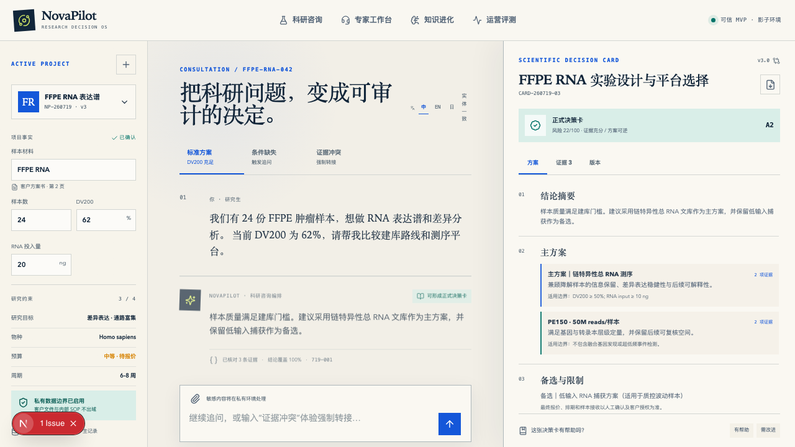
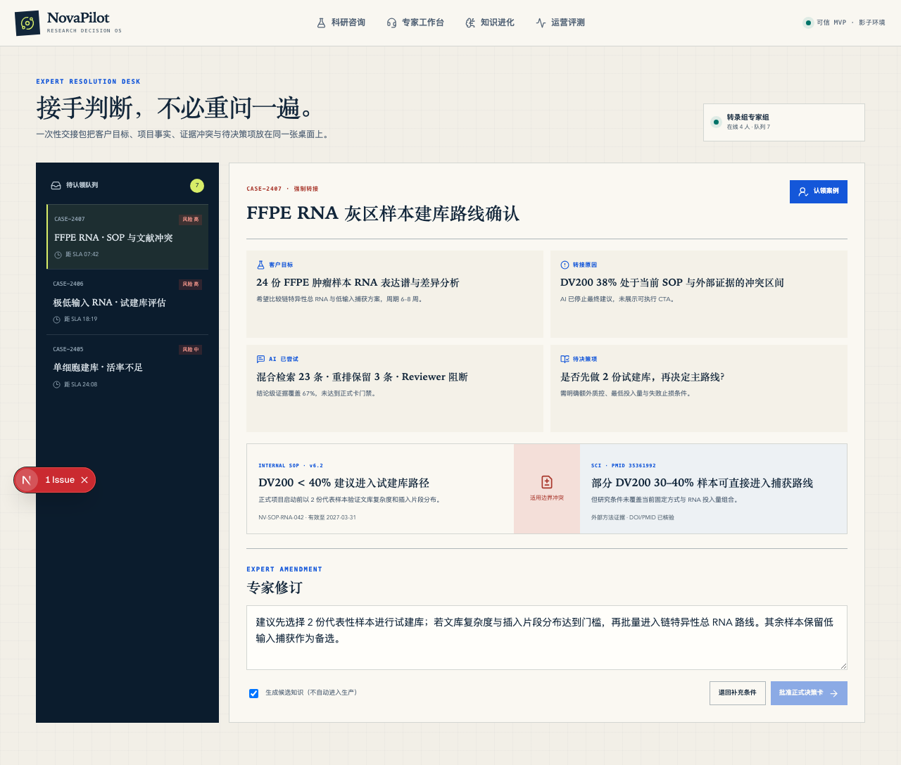
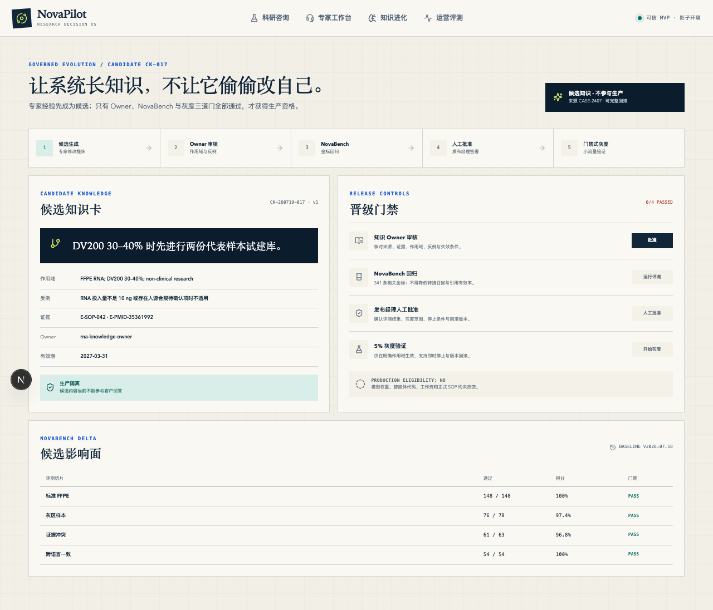
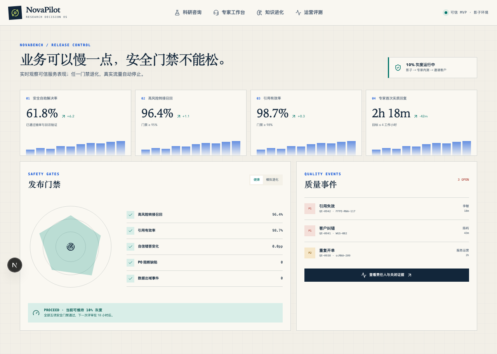

# NovaPilot — Trusted Scientific Research Customer Service Agent

> **2026 AI Pioneer Future Competition (飞书2026AI先锋未来大赛)** — Multi-round fusion optimization award
>
> [中文版](README.zh-CN.md)

NovaPilot is an AI-powered intelligent service system for **scientific research customer support**. It transforms how research institutions handle multi-channel, multi-language, multi-expertise technical consulting — replacing fragmented manual workflows with a structured, evidence-driven decision engine.

## Screenshots

| Customer Consultation | Expert Workbench |
|:---:|:---:|
|  |  |
| Multi-turn Q&A with scientific decision cards | Evidence binding, consent escalation, approval |

| Knowledge Evolution | Operations Dashboard |
|:---:|:---:|
|  |  |
| GraphRAG knowledge base with structured memory | Quality metrics, release gates, feedback loops |

## Key Features

| Module | Description |
|---|---|
| **🧑‍💻 Customer Consultation** | Multi-turn, context-aware Q&A with domain routing and decision card generation |
| **🔬 Expert Workbench** | Scientific decision cards, evidence binding, consent escalation, and recommendation approval |
| **🧠 Knowledge Evolution** | GraphRAG + cross-encoder re-ranking + structured memory (xMemory) over curated scientific knowledge base |
| **📊 Operations Dashboard** | Consultation metrics, quality evaluation, release gate governance, feedback loops |

## Architecture Highlights

- **Agentic RAG pipeline** with LangGraph orchestration, MCP tool integration, and self-evolving feedback flywheel
- **Scientific Decision Cards** as the primary artifact — each recommendation bound to evidence, risk-tiered, and approval-gated
- **Multi-modal support** — text, document, and structured data queries over a unified knowledge base
- **Three-language service** (CN/EN/JP) from a single knowledge base (ADR-0008)
- **Release gate governance** for controlled evolution of model behavior and knowledge updates (ADR-0009)

## Tech Stack

- **Frontend**: Next.js 15 (App Router), TypeScript, React
- **Backend**: Next.js API Routes, domain-driven models
- **Testing**: Vitest, 15 domain model tests
- **Quality**: Desktop/mobile responsive, WCAG A/AA compliance

## Getting Started

```bash
npm install
npm run dev
```

Open in browser:

| Page | URL |
|---|---|
| Customer Consultation | http://localhost:3000 |
| Expert Workbench | http://localhost:3000/expert |
| Knowledge Evolution | http://localhost:3000/knowledge |
| Operations Dashboard | http://localhost:3000/operations |

### Verify

```bash
npm test        # 15 domain tests
npm run typecheck
npm run build
```

## Project Structure

```
src/                      ← Runable source code (Next.js app)
  app/                    ← Pages & API routes
  components/             ← 7 UI components
  domain/                 ← Domain models + tests
docs/
  adr/                    ← 13 Architecture Decision Records
  agents/                 ← Agent collaboration rules
deliverables/             ← Selected competition deliverables
  *.md                    ← Final proposal outlines
  *.svg                   ← Architecture diagrams
  PRD/                    ← Product Requirements Document
```

## ADR Highlights

- [ADR-0001](docs/adr/0001-define-prd-as-blueprint-with-trusted-mvp.md) — PRD as blueprint with trusted MVP
- [ADR-0004](docs/adr/0004-make-scientific-decision-card-the-primary-artifact.md) — Scientific Decision Card as primary artifact
- [ADR-0008](docs/adr/0008-use-one-knowledge-base-for-three-language-service.md) — Single KB for three-language service
- [ADR-0009](docs/adr/0009-govern-evolution-through-candidates-and-release-gates.md) — Release gate governance

## License

MIT
