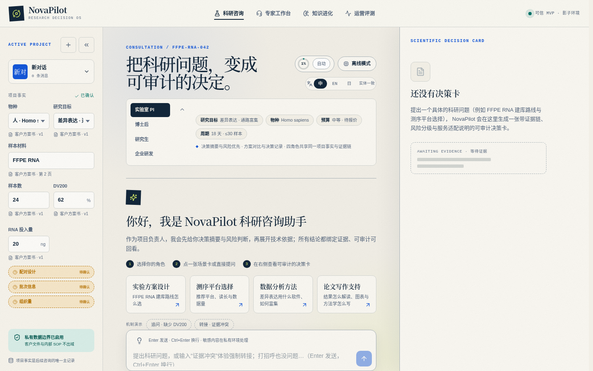
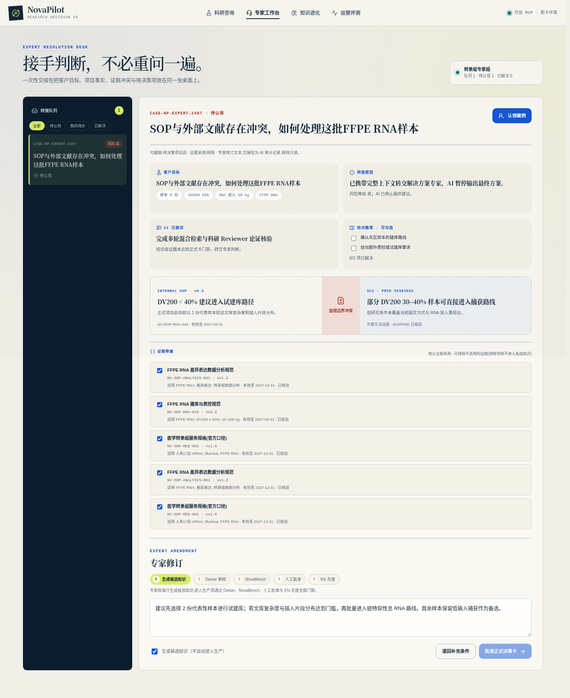
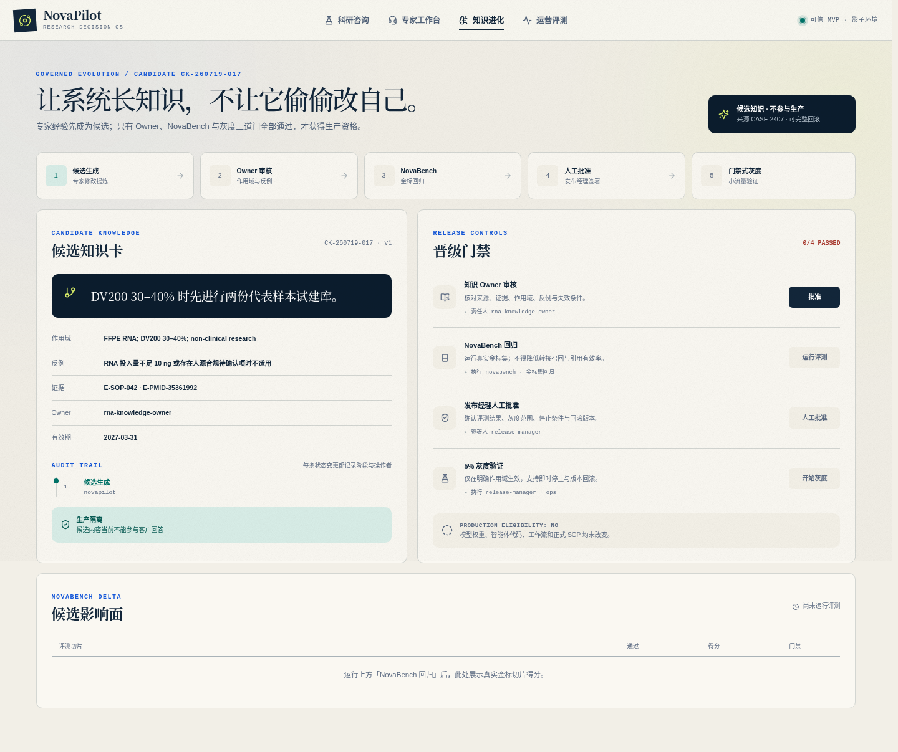
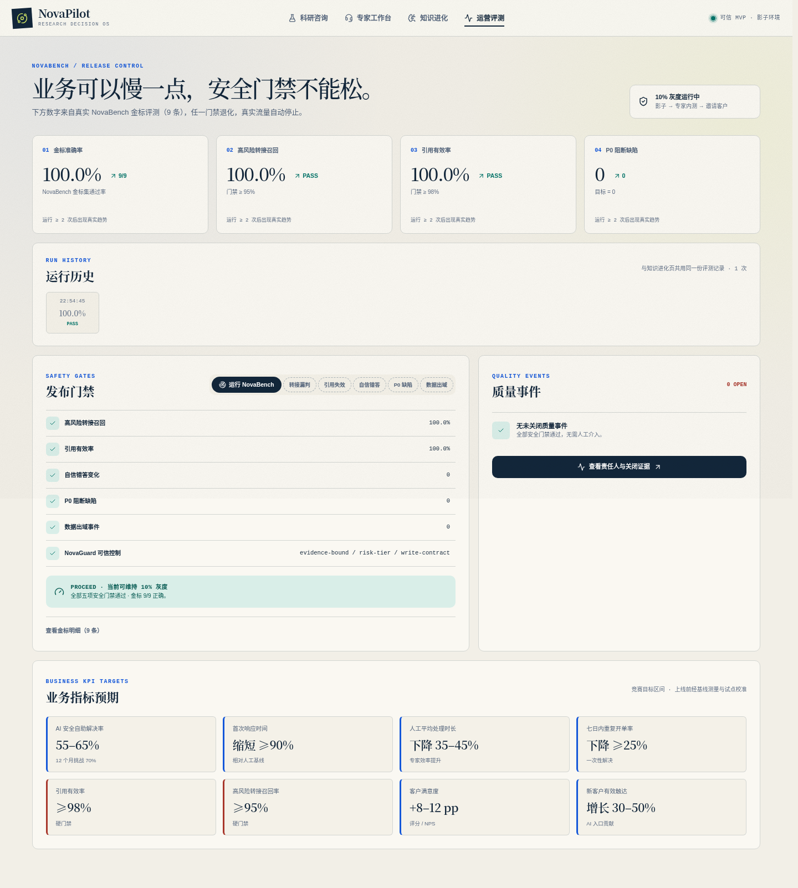

# NovaPilot — 可信科研客户服务智能体

> **2026 AI 先锋未来大赛(飞书)** · [英文版](README.md) · [部署说明](部署说明.md) · [架构说明](NovaPilot-Agent架构说明.md) · [参赛方案提交文档](参赛方案提交文档.md) · [前端优化记录](前端优化说明.md)

NovaPilot 是面向**科研客户技术支持与咨询**的 AI 智能服务体系:证据充分时安全解决问题、
证据不足时准确追问、风险较高时携带完整上下文转交专家,并把每一次专家修订经治理后反哺知识库。

- **默认离线确定性运行**:无需任何 API Key,端到端可复现。
- **每条建议绑定证据**:引用只能来自已验证的 SOP/文献证据块,由规则终审的 Critic 强制执行。
- **受治理自进化**:专家修订成为候选知识,经 Owner 审核 + NovaBench 金标回归 + 人工批准 + 灰度
  四道门禁才进生产,支持一键回滚与全程审计。

## 在线体验(点链接直接启动)

NovaPilot 依赖 Node 服务端(内置 `node:sqlite` 本地数据库),**无法部署到 GitHub Pages(纯静态托管)**:

- **Render 免费一键部署**(公开链接):
  
  部署后获得 `https://novapilot.onrender.com`。免费实例空闲约 15 分钟休眠,访问时数十秒自动唤醒。
- **GitHub Codespaces**:仓库页 Code → Codespaces 一键启动,自动安装构建,端口 3210 自动转发预览。

## 界面截图

| 客户咨询 | 专家工作台 |
|:---:|:---:|
|  |  |
| 四角色镜头问答、流式回复、科学决策卡 | 证据审查、SLA 队列、修订审批 |

| 知识进化 | 运营评测 |
|:---:|:---:|
|  |  |
| 候选、门禁、灰度、一键回滚 | 真实趋势、退化矩阵、质量事件、金标明细 |

## 核心模块

| 模块 | 说明 |
|---|---|
| **🧑‍🔬 客户咨询** | 四角色工作台(PI/博后/研究生/企业研发)多轮问答;流式输出;场景推断;科学决策卡(预算/周期/风险刻度/证据芯片点击跳转) |
| **🛠 专家工作台** | 转接队列(风险排序 + SLA 倒计时);一次性交接包;证据逐条审查(排除项不进入候选知识);修订 → 候选知识 |
| **🧠 知识进化** | 候选切换器;Owner → NovaBench → 人工批准 → 5% 灰度;逐门禁审计轨迹;一键回滚;候选影响面刷新不丢失 |
| **📊 运营评测** | 真实 NovaBench 运行与历史趋势;五开关退化矩阵(逐门禁注入故障);质量事件(关闭证据必填);9 条金标明细;KPI 目标板 |

**飞书五合一集成**(全部可选,凭证缺失时优雅禁用):

| 飞书能力 | NovaPilot 落点 |
|---|---|
| 企业豆包 | 火山方舟作为 LLM 后端(OpenAI 兼容,env 自动注册激活) |
| aily 智能助手 | 咨询入口,决策卡以消息卡片回传 |
| 多维表格 | 决策卡/质量事件自动双写(幂等 upsert) |
| 妙搭 | 无代码看板(交付表结构 + 视图配方) |
| 智能纪要 | 会议纪要 → 项目事实抽取(DV200/样本数/物种…) |

详见 [docs/feishu/飞书五合一集成说明.md](docs/feishu/飞书五合一集成说明.md) 与 [docs/feishu/妙搭看板表结构.md](docs/feishu/妙搭看板表结构.md)。

## 架构亮点

- **确定性编排状态机**(LangGraph 替代):每节点落 DB checkpoint,可审计可重放。
- **Actor–Critic 双智能体 + 规则终审**:模型只写散文,标题/引用/边界由规则派生,幻觉引用不可能通过。
- **三层证据接地防线**:检索接地 → 规则核验 → 语义复核,任何一层可拒绝推荐;三轮无证据即携完整论证链转专家,绝不硬编。
- **NovaGuard 可信控制**:证据白名单(有据才答)、风险分级审批(该转就转)、写契约(401/403/412/428)。
- **科学决策卡**核心工件:formal / provisional / needs-conditions / expert-review 四态状态机(ADR-0004)。
- **离线确定性是硬不变式**:145 个单测 + 14 个 Playwright 验收脚本全部可离线复现。

## 技术栈

- **前端**:Next.js 15(App Router)、React 19、TypeScript、zod、lucide-react
- **后端**:Next.js API Routes、Node 内置 `node:sqlite`(零原生依赖)、领域驱动设计
- **AI**:OpenAI 兼容模型网关(豆包火山方舟 / Claude / 自建)带离线确定性回退
- **测试**:Vitest(145 个单测)+ Playwright(14 个 E2E 验收脚本)

## 快速开始

    npm install
    npm run build
    PORT=3210 npm start

浏览器打开:

| 页面 | 地址 |
|---|---|
| 客户咨询 | http://localhost:3210 |
| 专家工作台 | http://localhost:3210/expert |
| 知识进化 | http://localhost:3210/knowledge |
| 运营评测 | http://localhost:3210/operations |

### 质量验证

    npm test            # 145 个单测
    npm run typecheck   # tsc --noEmit
    npm run build       # 生产构建

### E2E 验收脚本(本地,端口 3210)

    rm -rf .data                # 每个脚本前清库
    node .knowledge-check.cjs   # 依此类推,共 14 个

脚本清单:capability · streaming · align · composer · pin · role-lens · facts · card · collapse ·
expert · knowledge · operations · click-audit · smoke,每个脚本输出 PASS/FAIL 汇总。

## 项目结构

    src/
      app/                     页面与 API 路由(consultations / expert-cases / knowledge / quality-events / feishu)
      components/              UI 组件
      domain/                  领域模型与核心逻辑 + 测试
      server/
        orchestration/         确定性编排图 + checkpoint
        agents/                Actor-Critic、意图分类、模型网关
        rag/                   混合检索、种子知识、案例记忆
        guards/                NovaGuard 发布门禁
        eval/                  NovaBench 金标集、受治理晋级
        db/                    SQLite schema 与仓储
        feishu/                飞书五合一集成(凭证门控)
    docs/
      adr/                     13 项架构决策记录
      feishu/                  飞书集成说明 + 妙搭配方
    deliverables/              竞赛文档(大纲、PDF、架构 SVG)
    前端优化说明.md              前端优化记录(9.1–9.15)

## ADR 精选

- [ADR-0001](docs/adr/0001-define-prd-as-blueprint-with-trusted-mvp.md) — PRD 作为蓝图,构建可信 MVP
- [ADR-0004](docs/adr/0004-make-scientific-decision-card-the-primary-artifact.md) — 科学决策卡作为核心工件
- [ADR-0008](docs/adr/0008-use-one-knowledge-base-for-three-language-service.md) — 单一知识库支持三种语言
- [ADR-0009](docs/adr/0009-govern-evolution-through-candidates-and-release-gates.md) — 发布门控治理
- [ADR-0012](docs/adr/0012-approve-decision-cards-by-risk-tier.md) — 按风险分级审批决策卡
- [ADR-0013](docs/adr/0013-consolidate-safety-controls-into-novaguard.md) — NovaGuard 可信控制整合

## 许可

MIT
