# NovaPilot Agent 思考链路 · 完整架构说明

> 本文档完整描述 NovaPilot 咨询智能体从"用户提问"到"决策卡输出"的全部推理链路、子系统构成、数据流与关键设计不变式。内容严格对齐当前代码。
>
> **核心源文件索引**
>
> | 子系统 | 文件 |
> |---|---|
> | 编排状态机 | [`src/server/orchestration/graph.ts`](src/server/orchestration/graph.ts) |
> | Actor–Critic 双智能体 + 语义核验 | [`src/server/agents/actor-critic.ts`](src/server/agents/actor-critic.ts) |
> | 模型网关（双档路由 + 离线回退） | [`src/server/agents/model-gateway.ts`](src/server/agents/model-gateway.ts) |
> | 混合检索 | [`src/server/rag/retrieval.ts`](src/server/rag/retrieval.ts) |
> | 相似案例记忆 | [`src/server/rag/case-memory.ts`](src/server/rag/case-memory.ts) |
> | 持久化 schema | [`src/server/db/schema.ts`](src/server/db/schema.ts) |
> | 领域模型 | [`src/domain/consultation-journey.ts`](src/domain/consultation-journey.ts) |
> | 前端渲染 | [`src/components/markdown.tsx`](src/components/markdown.tsx) |

---

## 目录

1. [背景与设计哲学](#1-背景与设计哲学)
2. [系统分层架构](#2-系统分层架构)
3. [端到端调用时序](#3-端到端调用时序)
4. [编排状态机 · 总流程](#4-编排状态机--总流程)
5. [GROUNDING LOOP 放大图](#5-grounding-loop-放大图)
6. [子系统放大 ① 混合检索](#6-子系统放大--混合检索)
7. [子系统放大 ② Actor 起草](#7-子系统放大--actor-起草)
8. [子系统放大 ③ Critic + 语义复核](#8-子系统放大--critic--语义复核)
9. [模型网关 · 双档路由与离线回退](#9-模型网关--双档路由与离线回退)
10. [相似案例记忆](#10-相似案例记忆)
11. [三层接地防线](#11-三层接地防线)
12. [假设驱动追问](#12-假设驱动追问)
13. [决策卡状态机](#13-决策卡状态机)
14. [可回溯：Checkpoint 与 Trace](#14-可回溯checkpoint-与-trace)
15. [关键不变式清单](#15-关键不变式清单)

---

## 1. 背景与设计哲学

NovaPilot 是一个面向科研服务（FFPE RNA 建库/测序方案咨询）的**双智能体决策系统**。它的目标不是"生成一段听起来专业的话"，而是产出**每一句都可溯源到已验证 SOP/文献证据**的决策卡。

三条贯穿全局的设计原则：

- **离线确定性是硬不变式（HARD invariant）**
  没有任何 API key 时，系统必须能完全离线、确定性地跑通端到端。模型网关会回退到本地生成器，Actor/Critic 退化为规则接地。所有测试都依赖这一点。**任何新特性都不能破坏离线确定性。**

- **证据完整性不可让渡**
  引用（citation）只能来自 `validation === "verified"` 的 SOP/SCI 证据块。相似历史案例、模型散文，都不能成为引用来源。规则引擎（Critic）对此有终审权，无论在线模型怎么写。

- **逐层收紧、优雅耗尽**
  一条推荐要经过检索接地 → 规则核验 → 语义复核三道关；三轮加深检索仍无证据支撑时，系统不会硬编一个答案，而是带着完整论证链转人工专家。

> 设计中借鉴外部思路时坚持自研（clean-room）：代码与注释中不出现外部项目/论文名。

---

## 2. 系统分层架构

```mermaid
flowchart TB
    subgraph FE[前端 · Next.js App Router / React 19]
      MD["&lt;Markdown&gt; 零依赖渲染器<br/>headings / bold / list / [citation] / $math$"]
      CARD["决策卡面板 · 咨询会话线程"]
    end

    subgraph SVC[服务层]
      CONSULT["service.consult()<br/>recordMemory: true"]
    end

    subgraph ORCH[编排层 · LangGraph 替代]
      GRAPH["runConsultationGraph<br/>确定性状态机 · 每节点落 checkpoint"]
    end

    subgraph AGENTS[智能体层]
      ACTOR["Actor<br/>起草证据接地的推荐"]
      CRITIC["Critic<br/>规则核验（权威）"]
      VG["verifyGrounding<br/>语义复核（mini 档）"]
    end

    subgraph RAG[检索与记忆层]
      RET["混合检索<br/>BM25 ⊕ 向量 ⊕ rerank"]
      CM["相似案例记忆<br/>record / search"]
    end

    subgraph GW[模型网关]
      ROUTE["双档路由 main/mini<br/>敏感数据路由 + 离线回退"]
    end

    subgraph DB[(持久化 · SQLite / node:sqlite)]
      T1["projects / project_facts"]
      T2["documents / chunks（RAG 索引）"]
      T3["decision_cards"]
      T4["checkpoints（可回溯）"]
      T5["case_memory（相似案例）"]
      T6["expert_cases / messages ..."]
    end

    CARD --> CONSULT --> GRAPH
    GRAPH --> ACTOR --> ROUTE
    GRAPH --> CRITIC
    GRAPH --> VG --> ROUTE
    GRAPH --> RET --> DB
    GRAPH --> CM --> DB
    GRAPH --> DB
    GRAPH -->|ConsultationResult| CARD
    CARD --> MD
```

**关系映射**（项目把三种外部组件折叠进单一 SQLite，便于本地端到端运行）：

| 提案中的组件 | NovaPilot 的落地 |
|---|---|
| PostgreSQL（项目记忆） | SQLite 关系表 |
| OpenSearch（混合检索） | `chunks` 表 + 代码内倒排索引 |
| Neo4j（知识图谱） | `graph_nodes` / `graph_edges` 邻接表 |
| LangGraph（编排） | `runConsultationGraph` 确定性状态机 + `checkpoints` 表 |

---

## 3. 端到端调用时序

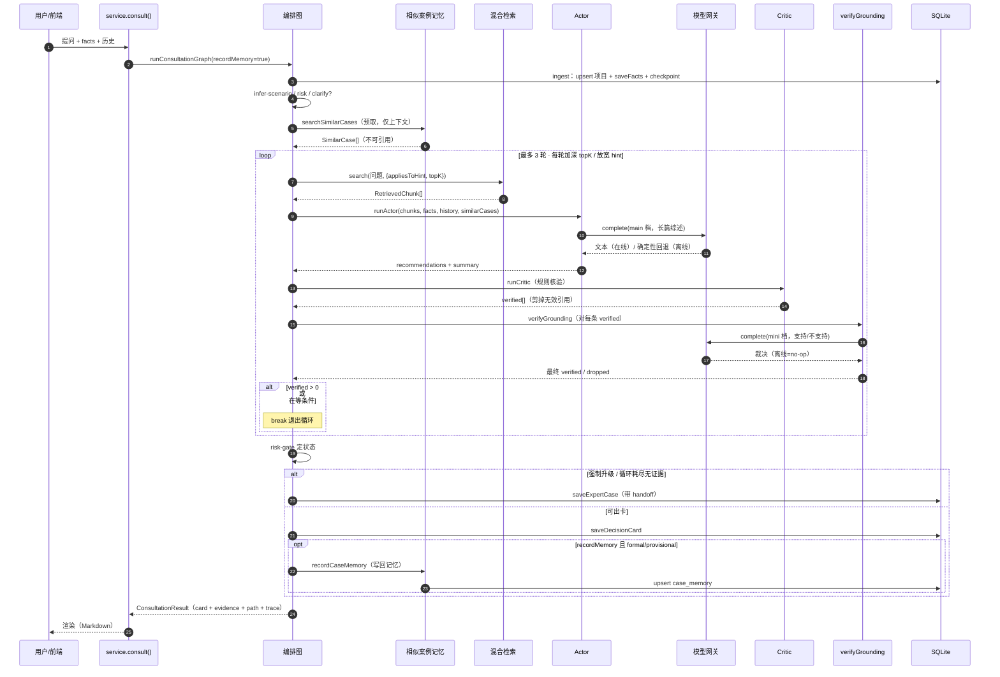

---

## 4. 编排状态机 · 总流程

### 4.0 一图速览（文本版）

```text
                          用户提问 (question + facts + history)
                                       │
                                       ▼
        ┌──────────────────────────────────────────────────────────────┐
        │                  runConsultationGraph  (确定性状态机)           │
        │           每个节点落一份 checkpoint 到 DB → 可回溯/可重放         │
        └──────────────────────────────────────────────────────────────┘
                                       │
   ① ingest ──────────► upsert 项目 + saveFacts(把 facts 写成带来源/置信度的记录)
                                       │
   ② infer-scenario ──► inferScenarioFromQuestion(问题, facts) → scenario
                                       │
   ③ risk ────────────► buildRisk(scenario, facts) → {level, mandatoryEscalation}
                                       │
   ④ clarify? ────────► 缺 DV200 / RNA input / material?  → 生成阻塞式追问
        │                (blockedByConditions = 是否在等客户补条件)
        │
        │      ┌──────────── 一次性预取（不进循环，仅上下文）────────────┐
        │      │  searchSimilarCases()  历史已解决相似案例                │
        │      │  → 喂给 Actor 当“先例参考”，【绝不可引用】               │
        │      └──────────────────────────────────────────────────────┘
        ▼
   ⑤ ┌═══════════════ GROUNDING LOOP (最多 MAX_ROUNDS=3 轮) ═══════════════┐
      ║                                                                    ║
      ║   round 0→1→2 :  topK = 5 → 10 → 20    hint 逐轮放宽:               ║
      ║                  "FFPE RNA" → "RNA" → 无限定(全库)                  ║
      ║                                                                    ║
      ║   [retrieve] ── search(db, 问题, {appliesToHint, topK})            ║
      ║        │        混合检索: BM25 词法 ⊕ 稠密向量 cosine ⊕ rerank       ║
      ║        ▼                                                            ║
      ║   [draft]  ──── runActor(chunks, facts, history, similarCases)     ║
      ║        │        · 在线: 模型综述 = 卡片 executiveSummary            ║
      ║        │        · 离线: 规则接地(挑 in-scope 的 SOP/SCI chunk)       ║
      ║        │        · 标题/引用/边界永远规则派生 → Critic 可校验          ║
      ║        ▼                                                            ║
      ║   [review] ─── runCritic(规则引擎, 权威)                            ║
      ║        │        每条推荐: 引用真实? 在检索集里? verified? 未过期?     ║
      ║        │        在 scope 内? → 通过的进 verified[], 剪掉无效引用      ║
      ║        │                                                            ║
      ║        ├─► verifyGrounding(语义复核, tier:"mini")                   ║
      ║        │        对每条 rule-verified 推荐问模型:“证据真支撑结论吗?”  ║
      ║        │        看开头“支持/不支持” → 不支持则丢弃                    ║
      ║        │        (离线=no-op,不推翻规则引擎; 走便宜的 mini 模型)       ║
      ║        ▼                                                            ║
      ║   verified.length > 0 ?  ──是──► break (已接地,出循环)              ║
      ║        │否                                                          ║
      ║   blockedByConditions ?  ──是──► break (在等客户,别空转)            ║
      ║        │否 → 加深一轮(更大 topK + 更宽 hint) 重新 retrieve→draft→review
      ╚════════════════════════════════════════════════════════════════════╝
                                       │
   ⑥ risk-gate ──► 决定状态:
        │   mandatoryEscalation 或 (循环耗尽仍无 verified 且非在等条件)
        │        → 转专家 (loopExhausted 时附完整论证链)
        │   blockedByConditions          → needs-conditions
        │   未达 SOP 边界 / 风险≠low / 无 verified → provisional
        │   其余                          → formal
        │
        ├──► ⑦a escalate  → saveExpertCase(带 handoff 上下文)
        │
        └──► ⑦b finalize  → 组装 DecisionCard
                             · formal 才带 recommendations
                             · formal 才 deriveConfirmations(从推荐路线的
                               适用边界反推“下一步需客户确认事项”—假设驱动)
                             · recordMemory 开启且 formal/provisional
                               → recordCaseMemory(写回相似案例记忆,喂未来)
                                       │
                                       ▼
                     ConsultationResult (card + evidence + path + trace)
                                       │
                                       ▼
                     前端 <Markdown> 渲染 executiveSummary / rationale
```

### 4.1 状态机流程图（Mermaid）

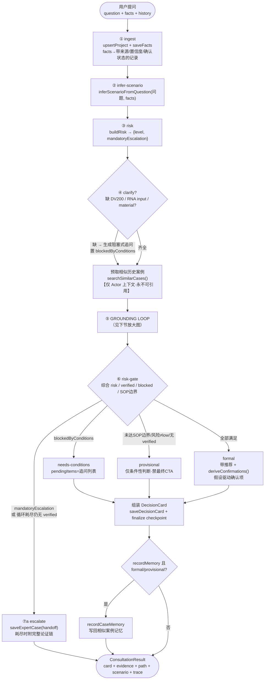

---

## 5. GROUNDING LOOP 放大图

循环最多 `MAX_ROUNDS = 3` 轮，每轮**加深检索**：

```
round      0            1              2
topK       5      →     10       →     20            （5 · 2^round）
hint     "FFPE RNA"  →  "RNA"     →   无限定(全库)    （broadenHint 逐轮放宽）
```

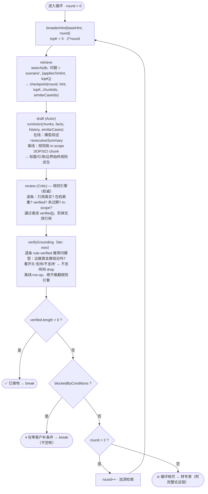

每轮都把 `{round, hint, topK, drafted, verified, grounding, dropped}` 追加进 `loopTrace`，并在 `retrieve`/`draft`/`review` 三处各落一份 checkpoint。

---

## 6. 子系统放大 ① 混合检索

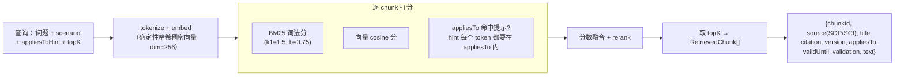

- 提示（hint）不是硬过滤，而是让"在 scope 内"的证据优先；逐轮放宽 hint 让检索面从"FFPE RNA"扩到全库。
- `appliesToMatches`：hint 的每个 token（如 `ffpe`、`rna`）都必须出现在证据的 `appliesTo` 里 —— 因此"FFPE-derived RNA expression profiling"算 in-scope，而一篇泛化的"degraded RNA"论文因缺 `ffpe` 被排除。

---

## 7. 子系统放大 ② Actor 起草

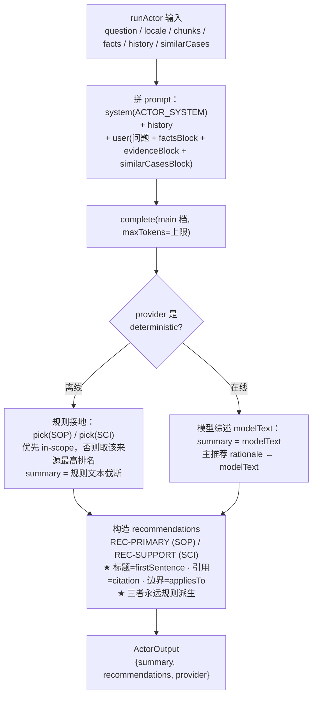

**要点**：在线模式下模型只接管**散文**（`summary` 与主推荐 `rationale`）；`title` / `evidenceIds` / `boundary` 始终由规则从 chunk 派生 —— 这保证下游 Critic 的溯源校验对模型输出同样有效。`similarCasesBlock` 在 prompt 里显式标注"仅供参考的先例、非证据、严禁作为引用来源"。

---

## 8. 子系统放大 ③ Critic + 语义复核

### 8.1 Critic 规则核验（权威、确定性）

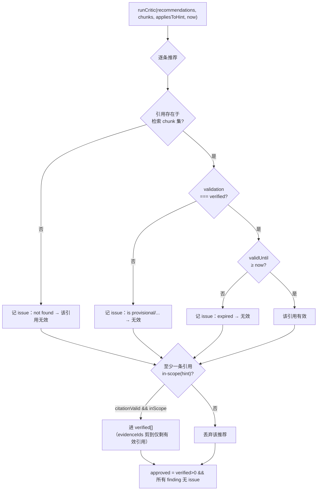

### 8.2 verifyGrounding 语义复核（mini 档，离线 no-op）

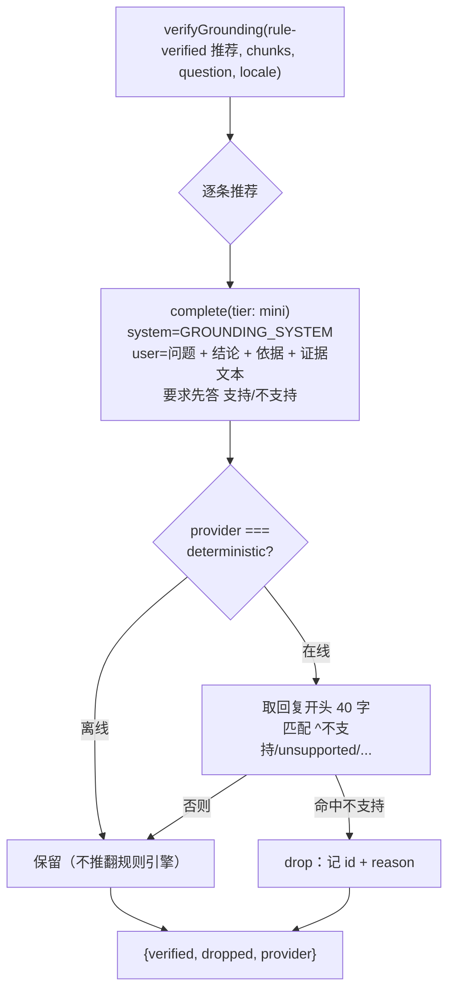

**为什么要第三层**：规则引擎只能判"引用是否真实、在 scope、未过期"这类**溯源**问题，判不出"引用是真的，但它其实不支撑这句结论"这类**空对空**。语义复核补上这一层；离线时它是安全 no-op，不影响确定性。

---

## 9. 模型网关 · 双档路由与离线回退

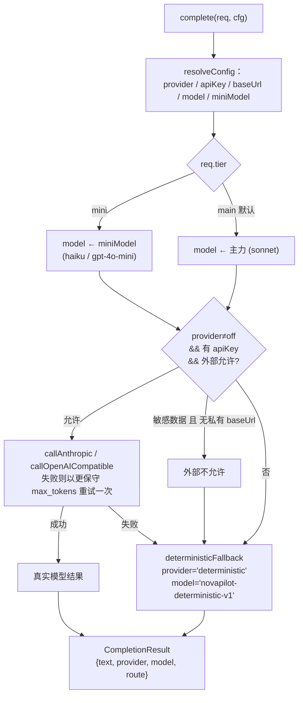

- **档位解析**：`miniModel` 从 `cfg.miniModel` → `NOVAPILOT_LLM_MINI_MODEL` 环境变量 → provider 默认值（anthropic→haiku，其他→gpt-4o-mini）三级解析；皆无则降级为主力模型（永不失败）。
- **敏感数据路由**：`sensitive` 数据只有在配置了私有（自托管、OpenAI 兼容）base URL 时才允许外发，否则强制走本地。
- **永不抛错**：缺凭据时降级到确定性回退，调用方总能拿到可用结果 —— 这是离线确定性的基石。

---

## 10. 相似案例记忆

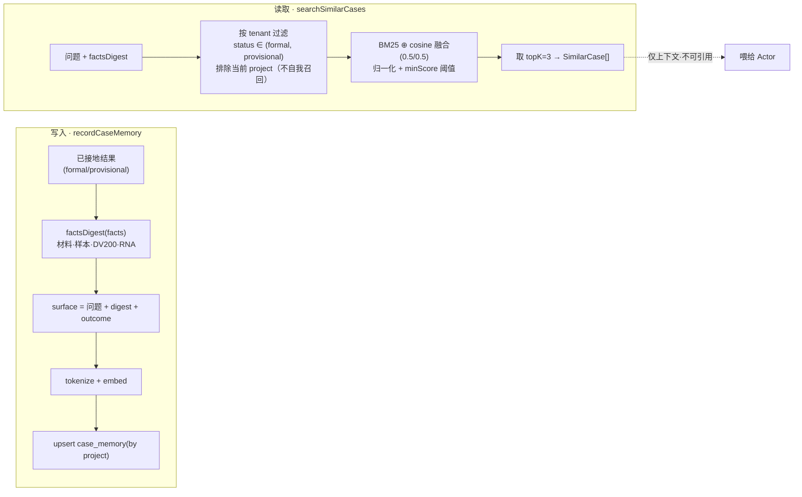

- **默认关闭写回**：`recordMemory` 默认 `false`，保证 eval / 测试不互相污染；只有线上 `service.consult()` 打开，且仅在 `formal` / `provisional` 时写回。
- **安全 no-op**：记忆为空时 `searchSimilarCases` 返回 `[]`，整层无副作用。
- **租户隔离**：检索按 `tenant_id` 严格作用域，跨租户不召回。

---

## 11. 三层接地防线

链路的核心是**逐层收紧的证据接地**，任何一层都可能拒绝一条推荐：

| 层 | 位置 | 判什么 | 离线行为 |
|---|---|---|---|
| **1. 检索接地** | `runActor` 挑 chunk | 优先选 in-scope（如 FFPE RNA）证据，而非只取 top-1 | 确定性 |
| **2. 规则核验** | `runCritic` | 引用真实存在、`verified`、未过期、in-scope → 权威裁决 | 确定性 |
| **3. 语义复核** | `verifyGrounding` | "证据是否*真的*支撑这句结论"（规则查不出的空对空） | no-op（不推翻规则） |

**关键不变式**：标题 / 引用 / 边界永远由规则派生，只有 `rationale` / `summary` 的散文允许被在线模型替换。因此无论模型说什么，Critic 的溯源校验都成立 —— **引用只能来自 SOP/SCI 证据块；相似历史案例只当"先例上下文"，永不可被引用。**

---

## 12. 假设驱动追问

`deriveConfirmations` **不是**固定字段清单，而是从推荐路线*自己的适用边界*正则反推 —— 只在 `formal` 卡出现，用来"细化"一个已接地的答案，从不阻塞它。

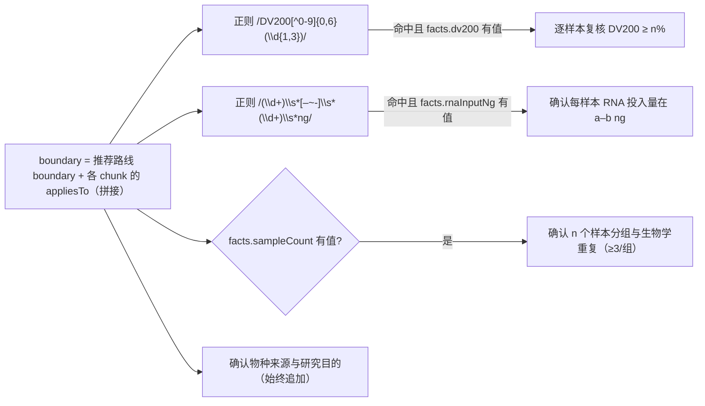

对比：`clarify`（第 ④ 节）是**阻塞式**追问（缺 DV200/input/material 就出不了正式卡）；`deriveConfirmations` 是**非阻塞式**确认（正式卡已成立，只是提示客户逐样本核对边界条件）。

---

## 13. 决策卡状态机

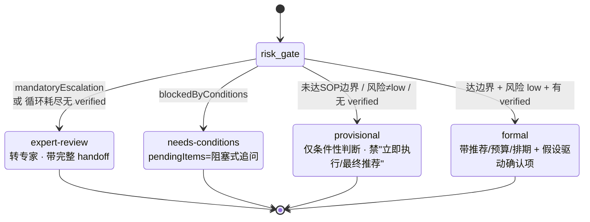

| status | 触发条件 | 卡片表现 |
|---|---|---|
| `formal` | 达 SOP 边界（DV200≥50 且 input≥10）+ 风险 low + 有 verified | 推荐、预算/排期、假设驱动确认项 |
| `provisional` | 未达边界 / 风险非 low / 无 verified | 仅条件性判断，禁最终 CTA |
| `needs-conditions` | 在等客户补 DV200 / input / material | 阻塞式追问列表 |
| `expert-review` | 强制升级，或循环耗尽仍无证据 | 转专家，带完整 handoff 上下文 |

---

## 14. 可回溯：Checkpoint 与 Trace

- **每个节点 + 每轮循环都写 `checkpoint`**（`checkpoints` 表，主键 `(trace_id, node)`，`ON CONFLICT` 更新），存 JSON 状态快照。
- `path: GraphNode[]` 记录**实际走过的节点序列**（如 `ingest → infer-scenario → risk → clarify → retrieve → draft → review → finalize`）。
- `loopTrace` 记录每轮 `{round, hint, topK, drafted, verified, grounding, dropped}`，可完整还原"为什么这轮没接地、下一轮怎么加深"。
- `getCheckpoints(db, traceId)` 按 `rowid` 顺序读回整条论证链，用于审计与重放。

这就是提案里"有状态智能体中枢 + 任务检查点"的落地。

---

## 15. 关键不变式清单

> 修改代码时请守住这些不变式，否则会破坏测试或证据完整性：

1. **离线确定性**：无 API key 时端到端必须确定性跑通；新特性不得引入在线依赖的必经路径。
2. **引用唯一来源**：citation 只能来自 `validation === "verified"` 的 SOP/SCI chunk。
3. **相似案例仅上下文**：`SimilarCase` 永不进入 `evidenceIds`，永不可引用。
4. **规则派生终审**：`title` / `evidenceIds` / `boundary` 始终规则派生，模型只接管散文。
5. **记忆写回默认关**：`recordMemory` 默认 `false`，保护 eval / 测试不被污染。
6. **优雅耗尽而非硬编**：三轮无证据 → 转专家附完整论证链，绝不编造答案。
7. **网关永不抛错**：缺凭据一律降级到确定性回退。
8. **clean-room**：代码/注释中不出现外部项目或论文名。

---

*本文档随代码演进维护；若与源码不一致，以源码为准。*
